<div align="center">

# TaiGong (太公)

**下一代红队社会工程学基础设施平台**

**Next-Generation Red Team Social Engineering Infrastructure**

> **「姜太公钓鱼，愿者上钩。」**  
> _"In the silence of the deep, the willing bite."_


[中文文档](#中文文档) | [English Documentation](#english-documentation)

</div>

<p align="center">
  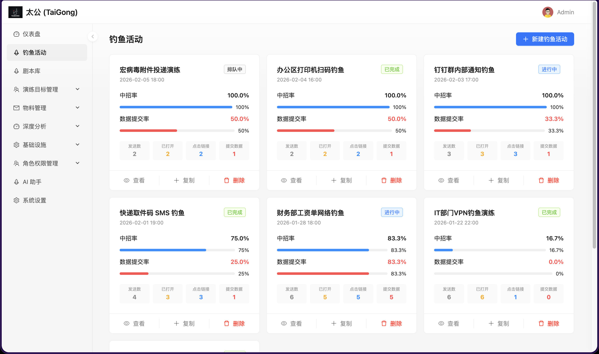
</p>

---

## 中文文档

### 项目状态

> [!IMPORTANT]
> **本项目不开源。** 仅发布社区版 (Community Edition)，源代码不对外公开。当前处于内部快速迭代中，功能持续演进。

- **不开源，仅发布二进制社区版** — 源代码不公开，只分发编译好的可执行文件
- **社区版免费使用** — Community Edition 可免费下载，包含核心功能
- **内部快速迭代中** — 核心功能与架构仍在持续演进，版本更新频繁
- **欢迎提交 Issue** — Bug 反馈、功能建议、使用问题均可在 GitHub Issues 提交

**🌐 官方网站:** [taigong.s4u2self.cc](https://taigong.s4u2self.cc/)

**联系方式:**
- **GitHub Issues**: [提交 Issue / 反馈](https://github.com/25smoking/TaiGong-Project/issues)
- **微信交流 (贡献/交流)**:

  

**💖 赞助支持:**

赞赏任意金额即可获得**月度授权**，用于支持项目改进和内部开发。赞助后请将截图发送至微信，我们将为您开通当月授权。

---

### 项目背景

过去十年，**Gophish** 是开源钓鱼平台的标杆。简单好用是它的过人之处，但在 2025 年面对高度敏感的 EDR、普及的零信任架构，以及能理解语义的 AI 邮件网关时，传统的"Gophish + 静态模板"打法已经远远不够了。

**TaiGong（太公）** 不只是一个对 Gophish 的二次开发，而是在深度武器化、智能化和企业化三个方向上对原版进行了几乎于全量的重写：

| 痛点 | TaiGong 的解法 |
|---|---|
| 特征显著，被 TI 平台标记 | 编译级去指纹 + 6 节点免杀 Pipeline |
| 单一邮件投递，缺乏多维覆盖 | Email + SMS + IM + 二维码 + 回复链 |
| 交互单一，无法对抗 MFA | Phishlet 反代 + 凭据实时捕获 |
| 依赖人工编写话术，难以规模化 | AI 辅助生成 + SOAR 自动编排 |
| 运维困难，不支持大规模多租户 | RBAC + 多租户 + 完整审计日志 |
| 无数据回流，只知道"有没有点" | 全参数指纹捕获 + 溯源时间轴 + 意识培训闭环 |

---

### 核心特性

#### ⚔️ 武器化免杀引擎 (Evasion Pipeline)

这是本版本相比旧版最核心的重写模块，由 6 个可组合的变换节点构成完整的内容免杀流水线：

**6 个变换节点 (Transform Nodes)**

| 节点 | 功能 |
|---|---|
| `polymorphic_attrs` | 多态 HTML 属性随机化，破坏静态签名匹配 |
| `dom_variation` | DOM 结构变异，随机插入隐藏元素和注释块 |
| `fingerprint_break` | 注入 HTTP/TLS 层指纹干扰代码，破坏 JA4 分析 |
| `semantic_dilution` | 语义稀释 — 向 HTML 注入行业无害语料，混淆 AI 邮件网关的语义分类 |
| `entity_noise` | HTML 实体噪音注入，在人眼不可见处插入 Unicode 干扰序列 |
| `mime_dilution` | MIME 层稀释，干扰基于 MIME 结构的沙箱特征分析 |

**3 级预设策略 (Strategy Presset)**

- `light` — 轻度变换，适合内部低风险演练，对邮件可读性影响最小
- `standard` — 标准变换，平衡免杀能力与内容可读性（**默认**）
- `aggressive` — 激进变换，全节点启用，针对顶级 EDR 和 AI 邮件网关

**治理层 (Governance Layer)**

- **Quality Gate** — 自动检测变换后 HTML 是否体积超标/内容异常，阻止被动降质
- **Circuit Breaker** — 基于状态机的熔断器，感知失败率后自动回退到轻量预设，防止大规模演练中免杀失效扩散
- **自定义策略 DSL** — 支持通过 JSON 自定义节点组合与执行预算
- **每次变换都会生成 `PipelineManifest`** — 包含 InputHash / OutputHash / MutationCount，实现完整的变换溯源

**语义稀释语料库 (`evasion/corpus.go`)**

内置中英文三行业（通用/科技/金融）良性语料，通过 `DilutionLevel`（轻/标准/激进）控制注入强度，混淆对抗 AI 邮件网关的语义分类器。

---

#### 🛡️ 访问控制与对抗体系 (Weaponization Console)

**智能访问过滤**

- **魔术页面 / 沙箱检测** — 通过 JS 探针识别无头浏览器、安全沙箱（签名库内置 `static/sandbox_signatures.json`），沙箱看到 404，真实用户才能看到钓鱼页面
- **地理围栏 (Geo-Fencing)** — 基于 IP 定位（国家/地区级），限制只有特定区域才可访问钓鱼页，国际 IP 静默重定向
- **云服务数据中心黑名单** — 自动拦截来自 AWS、阿里云、腾讯云、Azure 等云平台 IP 段的自动化探测请求
- **JA4/TLS 指纹识别** — 捕获并分析访客 TLS 握手 JA4 指纹，自定义黑名单过滤安全厂商扫描工具
- **IP 黑名单** — 支持手动配置 CIDR 块级别的访问过滤
- **Bot 检测引擎 (`controllers/bot_detection.go`)** — 独立的 UA 和行为特征检测模块
- **热配置加载** — 所有拦截策略的变更无需重启即可实时生效

**透明重定向策略**

被拦截的访客不会看到任何可疑页面，而是被**静默 302 重定向**到可配置的"安全伪装地址"（默认 `https://www.baidu.com`），针对蓝队实现信息零泄漏。

---

#### 🔁 Phishlet 反向代理 (Credential Relay)

参考 Evilginx 架构，新增了完整的 Phishlet（钓鱼代理规则集）管理系统：

- **Phishlet 配置** — 在 UI 中定义代理主机映射 (`ProxyHosts`)、响应内容替换规则 (`SubFilters`)、认证 Token 捕获规则 (`AuthTokens`) 和自定义注入 JS
- **会话捕获 (`models/captured_session.go`)** — 记录反代中间人过程中提取的 Cookie/Token/Session 信息
- **YAML 规则导入** — 支持与社区 Evilginx2 兼容的 `raw_yaml` 规则集导入

---

#### 🤖 SOAR 自动化引擎 (Automation Engine)

**事件驱动编排**

| 触发器类型 | 说明 |
|---|---|
| `cron` | Cron 表达式定时触发，如每周一 9 点自动发起演练 |
| `new_employee` | 新员工入职 N 天后自动触发入职安全意识演练 |
| `event` | 基于事件实时触发，如目标点击链接后自动发送第二封"异地登录警报"邮件 |

**动作类型**

- **`campaign` 动作** — 自动创建并启动新钓鱼活动（选择模板、落地页、SMTP、目标组）
- **`webhook` 动作** — 触发后向自定义 Webhook URL POST 事件数据，实现与外部 SIEM/C2 系统的联动

**执行历史** — 每次自动化触发都有完整的执行日志和状态追踪。

---

#### 📚 安全意识培训模块 (Awareness Training)

全新独立模块，实现演练闭环（攻击 → 发现 → 培训 → 复测）：

- **多模块课程设计** — 每门课程包含三个标准模块：培训邮件 (email)、宣贯页面 (page)、测验 (quiz)
- **测验题型** — 支持单选题、多选题、判断题、简答题
- **培训批次管理** — 一次性向多个目标下发培训邮件，支持立即下发和定时下发
- **成绩追踪** — 自动记录每个目标的完成状态、得分和完成时间
- **合规统计** — 批次维度的通过率、平均分、完成人数，支持按组织筛选

---

#### 📊 多阶段演练 (Multi-Stage Campaigns)

**阶段化攻击链**

- 支持最多 5 个阶段的串联攻击场景
- 每个阶段可独立配置触发条件（上阶段点击 / 提交 / 超时等）、等待时间、使用的模板和落地页
- **Stage Manager** 前端界面提供可视化的阶段编排
- 多阶段执行历史（`models/stage_execution.go`）完整记录每阶段激活记录

---

#### 🏢 企业级权限与审计 (RBAC + Audit)

**66 权限 5 角色 RBAC**

- 超级管理员 / 运营经理 / 数据分析师 / 审计员 / 只读角色
- 权限粒度细化到具体资源（Campaign / Template / Page / Group / SMTP）和操作（Create / Read / Update / Delete / Execute）
- 基于 Tenant 隔离，不同 Tenant 的任何数据完全隔离

**多租户 (Multi-Tenancy)**

- 支持为不同子公司/项目/演练批次创建独立 Tenant
- 内置配额管理逻辑（发送额度、并发活动数）
- 为 SaaS 化运营提供基础架构

**全量审计日志 (`models/audit_log.go`)**

- 所有敏感操作（配置变更、活动启停、用户管理）均留存审计记录
- 满足金融、能源等高合规行业的审计需求

---

#### 📡 多渠道投递 (Multi-Channel Delivery)

| 渠道 | 特性 |
|---|---|
| **增强邮件 (SMTP)** | CID 内嵌图片（100% 显示率）、去除 X-Gophish 指纹、伪装 Outlook/Zoho 客户端、智能 MIME 降级 |
| ~~**短信 (SMS)**~~ | ~~集成阿里云、腾讯云、Twilio；自定义短信模板~~ *(不符合社会价值观，已下线)* |
| **即时通讯 (IM)** | 钉钉/飞书/企业微信 Bot Webhook 投递，模拟内部运营通知 |
| **二维码钓鱼** | 原生 CID 内嵌二维码，离线可见，不触发"加载外部图片"警告 |
| **回复链攻击** | 伪造邮件回复，折叠进受害者历史邮件流，提升可信度 |

---

#### 🎯 AI 能力 (AI Assistant)

- **话术生成** — 接入 OpenAI / 智谱 GLM；一键生成针对特定行业/场景的高转化率钓鱼邮件内容
- **BYOK 模式** — 支持自带 API Key，数据不经第三方
- **Panic Button 联动** — 目标点击钓鱼链接后，AI 可自动触发生成并发送第二封"异地登录警报"邮件

---

#### 🔬 全参数指纹捕获 (Fingerprinting)

通过动态注入 JS 探针（`static/endpoint/fingerprint.js`）捕获完整的靶标环境信息：

- 真实公网 IP（绕过反向代理 / CDN，支持 X-Forwarded-For / X-Real-IP）
- JA4 / TLS 握手指纹
- Canvas 硬件唯一标识
- 浏览器 UA / 操作系统 / 屏幕分辨率 / 时区 / 语言 / CPU 核心数 / 内存
- 触屏支持 / Cookie 状态 / DNT 开关

**证据时间轴 (Evidence Timeline)**

管理后台对每个目标呈现完整的行为溯源时间轴（Email Sent → Email Opened → Clicked Link → Submitted Data），并在展开卡中显示该次事件关联的所有捕获字段（表单凭据 / 环境特征 / 原始 JSON）。

---

#### 📈 数据可视化与报告 (Analytics & Reports)

| 功能 | 描述 |
|---|---|
| **实时 Dashboard** | WebSocket 实时推送，无需刷新 |
| **漏斗分析** | 从发送 → 打开 → 点击 → 提交的完整转化漏斗（ECharts） |
| **地理热力图** | 靶标 IP 地理分布可视化 |
| **风险雷达图** | 多维度安全意识评分可视化 |
| **风险评分** | 基于行为的自动分级（高危 / 中危 / 低危），标记出高风险员工 |
| **PDF 导出** | 一键生成符合企业审计要求的演练报告 |
| **对比分析** | 多次历史演练横向数据对比 |

---

#### 🖥️ 现代化前端 (Modern Admin UI)

**18 个功能页面，基于 React 18 + Ant Design 5 完整重构：**

| 模块 | 说明 |
|---|---|
| `Dashboard` | 全局态势感知仪表盘 |
| `Campaigns` | 钓鱼活动管理 + 证据时间轴 + 阶段编排 |
| `Templates` | TinyMCE 富文本编辑器 + 变量提示 + 版本历史 |
| `LandingPages` | 落地页管理 + 多版本 + 克隆页面 |
| `Groups` | 目标组管理 + 部门层级 + LDAP/CSV 批量导入 |
| `SendingProfiles` | SMTP/SMS/IM 发送配置管理 |
| `Weaponization` | 武器化控制台（免杀 Pipeline、地理围栏、沙箱检测等一站式配置） |
| `AI` | AI 助手对话界面 + 批量话术生成 |
| `Automation` | SOAR 规则编排 + 执行历史 |
| `Awareness` | 安全意识培训课程/批次管理 |
| `Scenarios` | 场景库（预置完整攻击场景一键导入） |
| `RiskAnalytics` | 风险分析 + 深度 AI 洞察 + 用户风险画像 |
| `Reports` | PDF 报告生成 + 历史报告管理 |
| `Infrastructure` | 基础设施状态监控（域名/SSL/邮件健康度） |
| `Settings` | 系统配置（许可证/RBAC/全局参数） |
| `Users` | 用户与角色管理 |

**前端技术特性：**

- ECharts 数据可视化（漏斗图 / 地图热力 / 雷达图 / 时间轴）
- TinyMCE 富文本编辑器 + 变量智能提示
- Monaco Editor 代码编辑（HTML/JS/YAML 等）
- PDF 导出（jsPDF + html2canvas）
- 国际化 (i18n) — 中文 / English / 日本語 三语切换
- PWA 支持 + Service Worker

---

### 技术架构

```
┌───────────────────────────────────────────────────────────────┐
│             CDN / Nginx 反向代理层                              │
│      (TLS、Domain Fronting、X-Forwarded-For 透传)         │
└──────────────────────┬────────────────────────────────────────┘
                       │
┌──────────────────────▼────────────────────────────────────────┐
│                   TaiGong 核心进程                              │
│                                                               │
│  ┌───────────────────┐   ┌────────────────────┐              │
│  │  Admin Server      │   │   Phish Server     │              │
│  │  Port 3333 (HTTPS) │   │   Port 80/443      │              │
│  │  · React 18 SPA   │   │  · 落地页服务       │              │
│  │  · REST API        │   │  · Evasion Pipeline│              │
│  │  · WebSocket 推送  │   │  · Phishlet 反代    │              │
│  │  · RBAC 守卫       │   │  · 指纹/事件捕获    │              │
│  └───────────────────┘   └────────────────────┘              │
│                                                               │
│  ┌──────────────────────────────────────────────┐            │
│  │            Evasion Pipeline                   │            │
│  │  ① polymorphic_attrs  ② dom_variation        │            │
│  │  ③ fingerprint_break  ④ semantic_dilution    │            │
│  │  ⑤ entity_noise       ⑥ mime_dilution        │            │
│  │  Quality Gate ← Circuit Breaker              │            │
│  └──────────────────────────────────────────────┘            │
│                                                               │
│  ┌──────────────────────────────────────────────┐            │
│  │           Worker / Scheduler                  │            │
│  │  · Email / SMS / IM Mailer                   │            │
│  │  · SOAR Automation Engine (Cron/Event)       │            │
│  │  · Awareness Training Dispatcher             │            │
│  │  · AI Content Generation                     │            │
│  └──────────────────────────────────────────────┘            │
└──────────────────────┬────────────────────────────────────────┘
                       │
┌──────────────────────▼────────────────────────────────────────┐
│           数据持久化层                                          │
│  · SQLite (默认) / MySQL (大规模)                              │
│  · Redis (缓存 + WebSocket 实时消息队列, 可选)                  │
└───────────────────────────────────────────────────────────────┘
```

**技术选型**

| 组件 | 技术 | 说明 |
|---|---|---|
| **后端语言** | Go 1.20+ | 高并发性能，单文件部署 |
| **前端** | React 18 + Ant Design 5 + Vite | 现代化 SPA，前后端分离（go:embed 内嵌发布） |
| **数据库** | SQLite / MySQL | 默认 SQLite，支持 MySQL 集群 |
| **ORM** | GORM | SQLite / MySQL 双持 |
| **WebSocket** | Gorilla WS | Dashboard 实时数据推送 |
| **安全层** | JA4 + TLS Fingerprint (`psanford/tlsfingerprint`) | 底层对抗模块 |
| **任务调度** | Cron + Worker Pool | 自动化编排 |
| **TLS** | AutoCert (Let's Encrypt) + 自签证书 双模式 | 内置 ACME 客户端 |
| **国际化** | i18next + react-i18next | 三语动态切换 |

---

### 项目目录结构

```
taigong/
├── admin-frontend/        # React 18 前端 (Vite)
│   ├── src/pages/         # 18 个功能页面
│   └── src/components/    # 公共组件库 (Charts, Editor, RiskAnalytics...)
│
├── controllers/           # HTTP 路由处理器
│   ├── phish.go           # 钓鱼端 (事件捕获/Phishlet/Bot检测)
│   ├── route.go           # Admin 路由注册
│   ├── ws.go              # WebSocket 控制器
│   └── api/               # REST API 控制器集合
│
├── evasion/               # ⚔️ 免杀 Pipeline 引擎
│   ├── strategy_engine.go # 策略调度器 (Preset/Custom)
│   ├── strategy_types.go  # Pipeline 类型定义
│   ├── html_transform.go  # HTML 多态变换器
│   ├── semantic_diluter.go # 语义稀释注入
│   ├── corpus.go          # 中英文三行业良性语料库
│   ├── quality_gate.go    # 输出质量守卫
│   ├── circuit_breaker.go # 自适应熔断器
│   └── sandbox_signatures.go # 沙箱特征签名库
│
├── models/                # 数据模型层 (64 个文件)
│   ├── awareness.go       # 安全意识培训系统
│   ├── automation.go      # SOAR 自动化引擎
│   ├── phishlet.go        # Phishlet 反代规则
│   ├── campaign.go        # 钓鱼活动核心
│   ├── campaign_stage.go  # 多阶段演练
│   ├── rbac.go            # RBAC 权限系统
│   ├── tenant.go          # 多租户隔离
│   ├── evasion.go         # 武器化配置模型
│   ├── scoring.go         # 风险评分引擎
│   ├── audit_log.go       # 审计日志
│   ├── captured_session.go # Phishlet 会话捕获
│   └── license_runtime_state.go # 许可证运行时管理
│
├── services/              # 业务服务层
│   ├── plugin/            # 插件系统
│   ├── relay/             # 投递中继服务
│   ├── report/            # 报告生成服务
│   ├── sender/            # 多渠道发送服务
│   ├── smtp_check/        # SMTP 健康检测
│   └── threatintel/       # 威胁情报集成
│
├── middleware/            # 中间件 (CDN/IP/Cookie)
├── static/
│   ├── endpoint/          # 靶标端注入脚本 (fingerprint.js等)
│   ├── corpus/            # 规则语料库 JSON
│   └── sandbox_signatures.json # 沙箱特征库
│
├── build-unified.sh       # 一键构建脚本 (前端 → 嵌入 → Go编译)
├── config.json            # 主配置文件
└── taigong-backend        # 编译产物 (单二进制)
```

---

### 版本计划 (Licensing)

> [!NOTE]
> **快速迭代说明**
> 本项目处于快速开发阶段。当前社区版包含完整的核心功能与架构重写，并非阉割版。

为保证项目长期可持续发展，TaiGong 分为**社区版 (Community)** 与**赞助版 (Sponsor)**。

| 功能模块 | 社区版 | 赞助版 |
|---|---|---|
| **【基础】** | | |
| 邮件钓鱼 (SMTP) | ✅ 完整支持 | ✅ 完整支持 |
| TinyMCE 模板编辑器 | ✅ 完整支持 | ✅ 完整支持 |
| 落地页管理 | ✅ 完整支持 | ✅ 完整支持 |
| 目标组管理 | ✅ 完整支持 | ✅ 完整支持 |
| 二维码钓鱼 | ✅ 支持 | ✅ 支持 |
| WebSocket 实时推送 | ✅ 支持 | ✅ 支持 |
| **【免杀 Pipeline】** | | |
| 6 节点 Evasion Pipeline | ✅ 支持 | ✅ 支持 |
| light / standard 预设 | ✅ 支持 | ✅ 支持 |
| aggressive 预设 | ❌ | ✅ **支持** |
| 自定义策略 DSL | ❌ | ✅ **支持** |
| Quality Gate | ✅ 只告警 | ✅ **拦截模式** |
| Circuit Breaker | ✅ 基础 | ✅ **高级配置** |
| **【访问控制】** | | |
| 透明重定向 | ✅ 支持 | ✅ 支持 |
| 盲搜 RID | ✅ 支持 | ✅ 支持 |
| 编译级去指纹 | ✅ 支持 | ✅ 支持 |
| 地理围栏 | 🔶 国家/地区级 | ✅ **省市级精准** |
| 沙箱检测 | 🔶 基础规则 | ✅ **高级库 + 自动更新** |
| 云服务黑名单 | 🔶 内置规则 | ✅ **自定义 + 实时情报** |
| JA4 指纹识别 | ✅ 支持 | ✅ **自定义指纹库** |
| **【Phishlet 反代】** | | |
| Phishlet 管理 | ❌ | ✅ **支持** |
| Session/Cookie 捕获 | ❌ | ✅ **支持** |
| **【多渠道投递】** | | |
| SMS 钓鱼 | ❌ | ✅ **阿里云/腾讯云/Twilio** |
| IM 投递 (钉钉/飞书/企微) | ❌ | ✅ **支持** |
| 回复链攻击 | ❌ | ✅ **支持** |
| **【AI 与自动化】** | | |
| AI 话术生成 | 🔶 BYOK 模式 | ✅ **内置服务 + Prompt 库** |
| SOAR 自动化 (Cron/Event) | 🔶 基础规则 | ✅ **高级编排 + Webhook** |
| 多阶段攻击链 | ❌ | ✅ **最多 5 阶段** |
| Panic Button | ❌ | ✅ **支持** |
| **【安全意识培训】** | | |
| 培训课程管理 | ❌ | ✅ **支持** |
| 测验与评分 | ❌ | ✅ **支持** |
| 培训批次下发 | ❌ | ✅ **支持** |
| **【企业级】** | | |
| RBAC 权限系统 (66权限/5角色) | ❌ | ✅ **支持** |
| 多租户隔离 | ❌ | ✅ **支持** |
| 审计日志 | 🔶 基础 | ✅ **完整审计 + 合规导出** |
| **【数据分析】** | | |
| 基础统计图表 | ✅ 支持 | ✅ 支持 |
| ECharts 高级可视化 | 🔶 基础版 | ✅ **漏斗/热力图/雷达图** |
| 风险评分系统 | ❌ | ✅ **支持** |
| PDF 报告导出 | ❌ | ✅ **支持** |
| **【模板资源】** | | |
| 内置模板数量 | 64 个专业模板 | 64 个 + 持续更新 |
| 场景库 (Scenarios) | ❌ | ✅ **官方场景商店** |
| **【使用限制】** | | |
| 目标用户配额 | 最多 10 个 | **无限制** |
| 并发活动数 | 最多 5 个 | **无限制** |
| 定价 | **完全免费** | **暂未定价** |

> **Q: 社区版是阉割版吗？**  
> **A: 绝对不是。** 社区版包含完整的 Gophish 重架构（去指纹、React 重构、6节点 Evasion Pipeline、64 模板、完整邮件钓鱼能力），完全可以胜任中小规模的日常演练。赞助版面向的是需要**极高隐蔽性**（顶级 EDR 对抗）、**多渠道覆盖**（SMS/IM/Phishlet）、**企业级管理**（RBAC/多租户/审计）的专业红队和安全厂商。

---

### 快速开始

#### 环境要求

- Go 1.20+
- Node.js 18+ (前端构建，构建后不需要)
- SQLite 3 / MySQL 5.7+
- Redis（可选，用于缓存和 WebSocket 实时推送）

#### 一键构建 (推荐)

```bash
# 克隆仓库
git clone https://github.com/25smoking/TaiGong-Project.git
cd TaiGong-Project

# 一键构建：先编译前端 → 自动 go:embed → 编译 Go 二进制
./build-unified.sh

# 编辑配置文件（首次部署必须）
cp config.json.example config.json
vim config.json  # 配置端口、数据库、redirect_url、API密钥等

# 启动服务
./taigong-backend

# 访问管理界面
# https://localhost:3333
# 默认账号: admin  密码: 见启动日志
```

#### 分步构建

```bash
# 1. 构建前端
cd admin-frontend
npm install
npm run build
cd ..

# 2. 编译后端（前端已通过 go:embed 嵌入，无需单独分发 static/dist）
go mod download
go build -o taigong-backend .

# 3. 启动
./taigong-backend
```

> [!TIP]
> 从当前版本开始，以下资源已内嵌进后端二进制（`go:embed`），默认不再要求随包分发：
> - `static/builtin_templates/`（内置模板市场）
> - `db/schema/taigong_demo_data_complete.sql`（演示数据导入）
> - `static/GeoLite2-City.mmdb`（GeoIP 增强）

#### Docker 快速部署

```bash
# 构建镜像
docker build -t taigong:latest .

# 运行容器
docker run -d \
  --name taigong \
  -p 3333:3333 \
  -p 80:80 \
  -v $(pwd)/taigong.db:/app/taigong.db \
  -v $(pwd)/config.json:/app/config.json \
  taigong:latest
```

#### Linux 服务器部署（推荐用于生产）

```bash
# 使用预构建的 tar.gz 包
tar -xzf taigong-deploy-linux.tar.gz
cd deploy/
./start.sh
```

---

### 配置文件 (config.json)

```jsonc
{
  "admin_server": {
    "listen_url": "127.0.0.1:3333",   // Admin 监听地址，建议只监听本地
    "use_tls": true,
    "cert_path": "taigong_admin.crt",
    "key_path": "taigong_admin.key"
  },
  "phish_server": {
    "listen_url": "0.0.0.0:80",       // 钓鱼端对外监听
    "use_tls": false,
    // use_tls: true + auto_cert_domains 可启用 Let's Encrypt 自动证书
    "auto_cert_domains": []
  },
  "db_name": "sqlite3",               // "sqlite3" 或 "mysql"
  "db_path": "taigong.db",
  "migrations_prefix": "db/migrations/",
  "contact": "admin@example.com",
  "logging": {
    "filename": ""                    // 空字符串表示输出到 stdout
  }
}
```

> [!IMPORTANT]
> **生产部署建议**：Admin Server 只监听 `127.0.0.1:3333`，通过 Nginx 反向代理对外暴露。Nginx 层负责 TLS 终止，并在 `proxy_pass` 时透传 `X-Forwarded-For` 和 `X-Real-IP` Header，确保后端能正确记录靶标的真实公网 IP。

---

### 功能截图 (Screenshots)

#### 核心指挥舱

| 全局态势感知 | 风险分析仪表盘 |
|:---:|:---:|
|  | 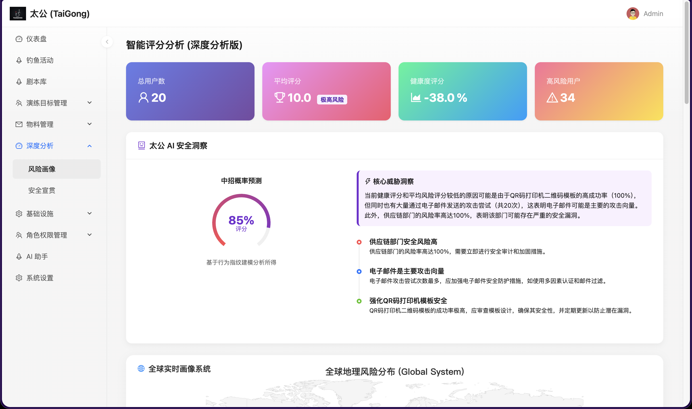 |
| **用户风险画像** | **风险趋势分析** |
| 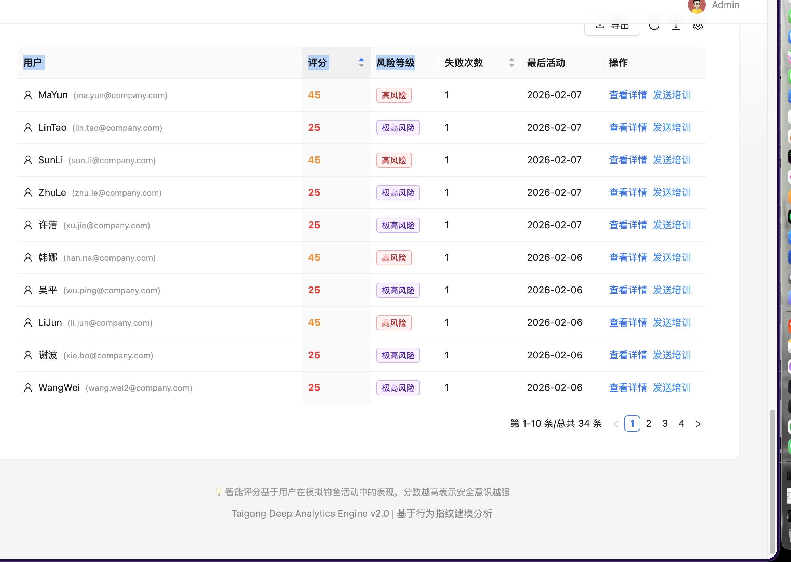 | 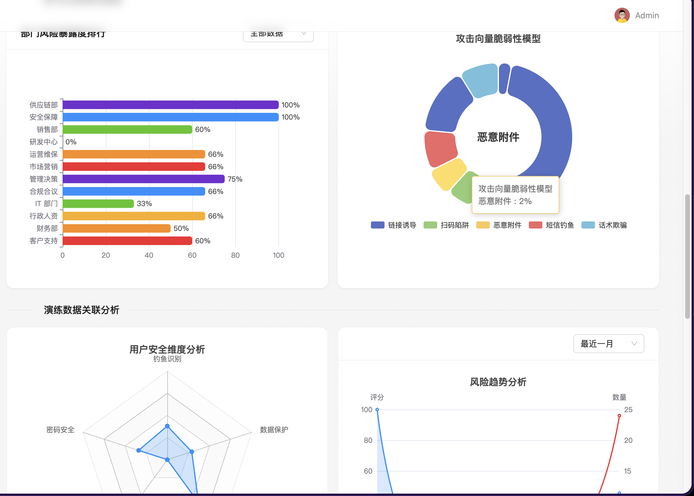 |

#### 武器化与 AI

| 武器化控制台 | AI 助手 |
|:---:|:---:|
| 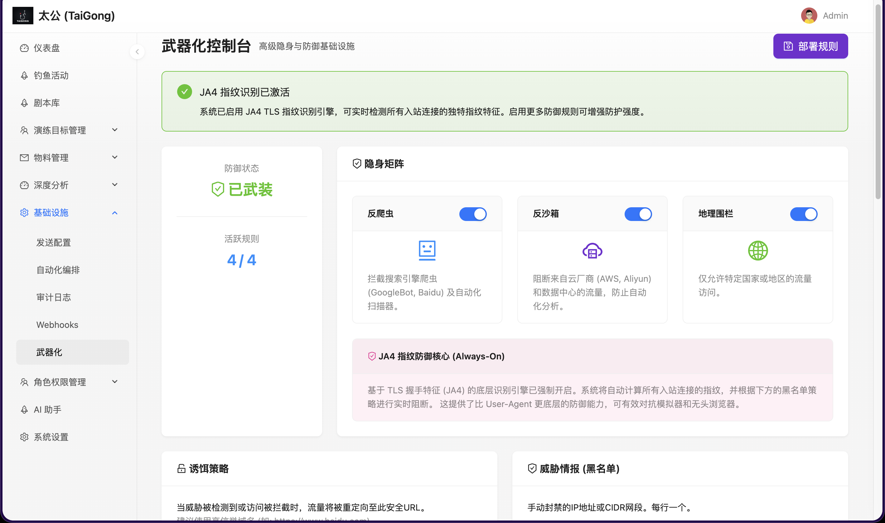 | 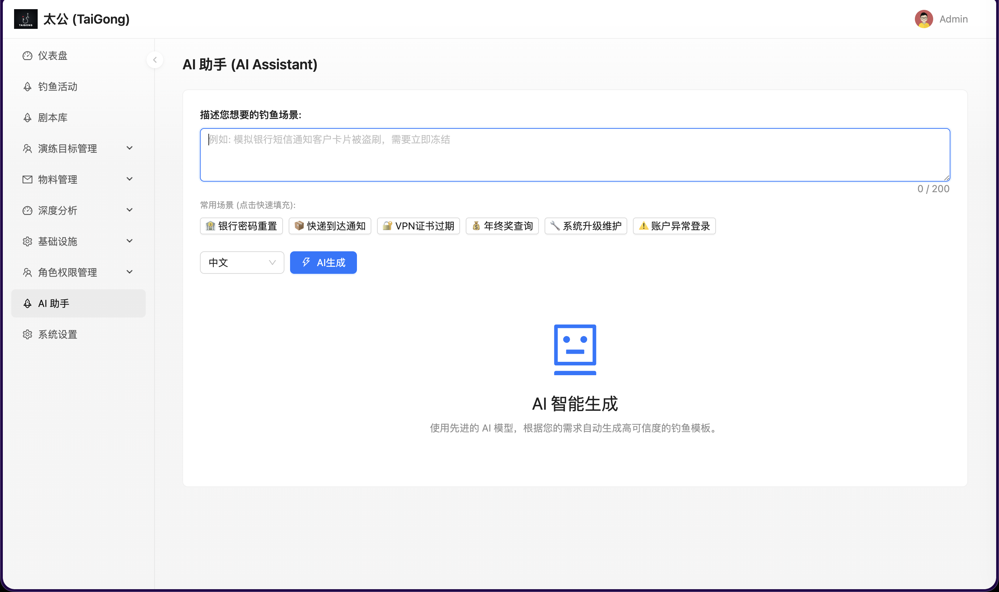 |
| **AI 内容生成** | |
| 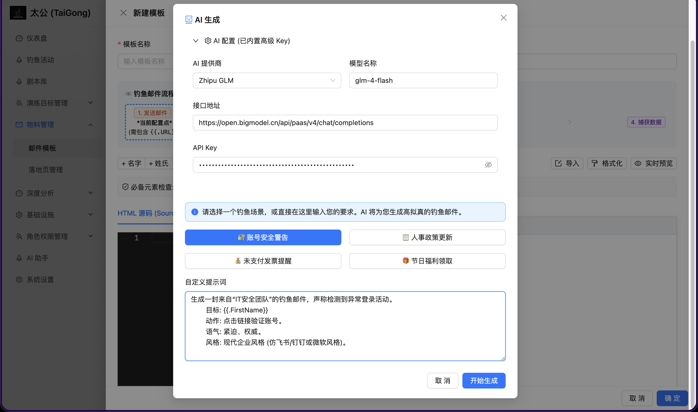 | |

#### 演练编排

| 新建演练 | 邮件投递配置 |
|:---:|:---:|
| 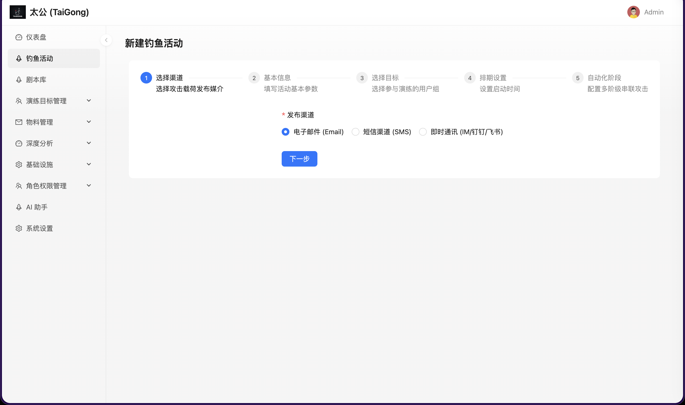 | 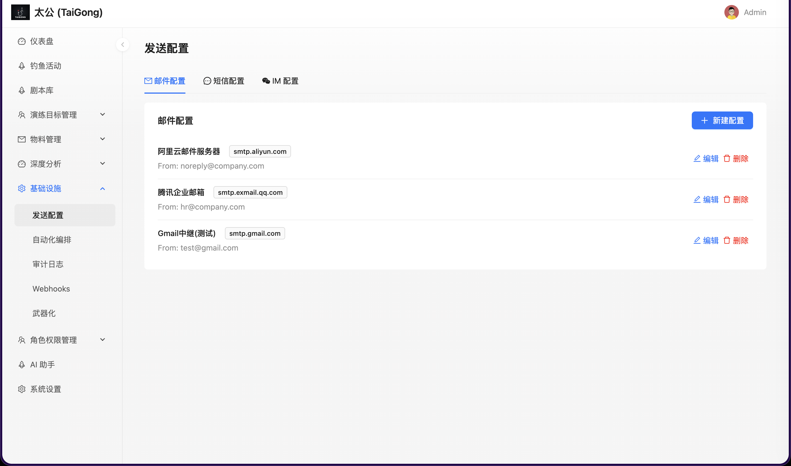 |
| **SMS 投递** | **交互响应追踪** |
| 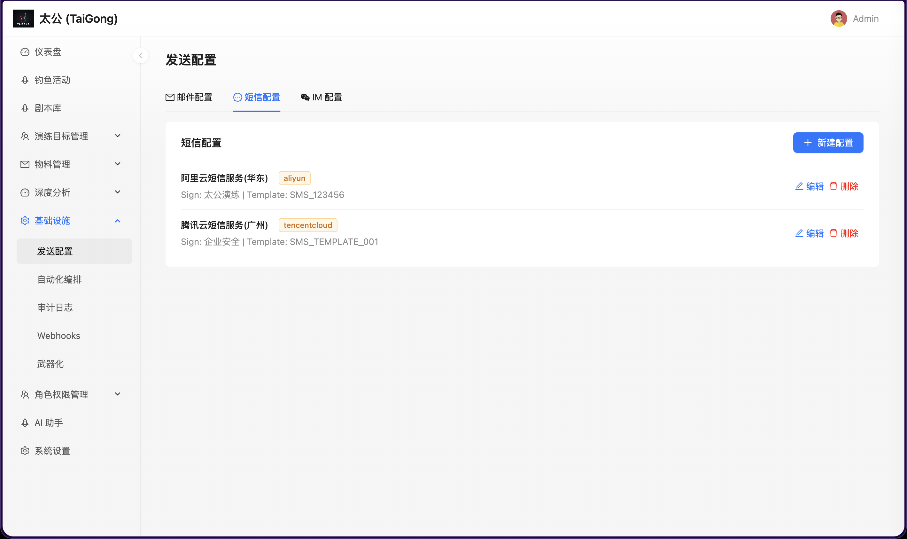 | 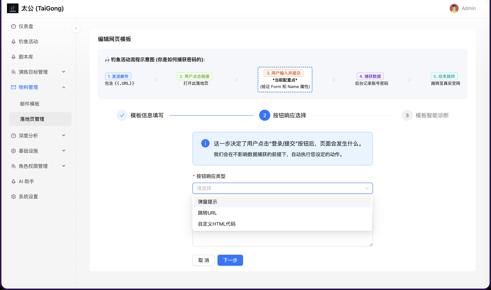 |

#### 模板与资源

| 落地页编辑器 | 落地页管理 |
|:---:|:---:|
| 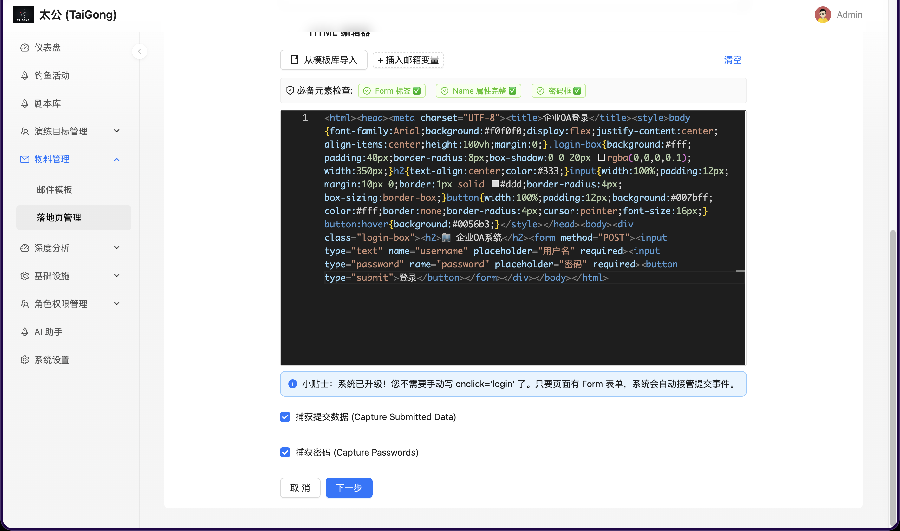 | 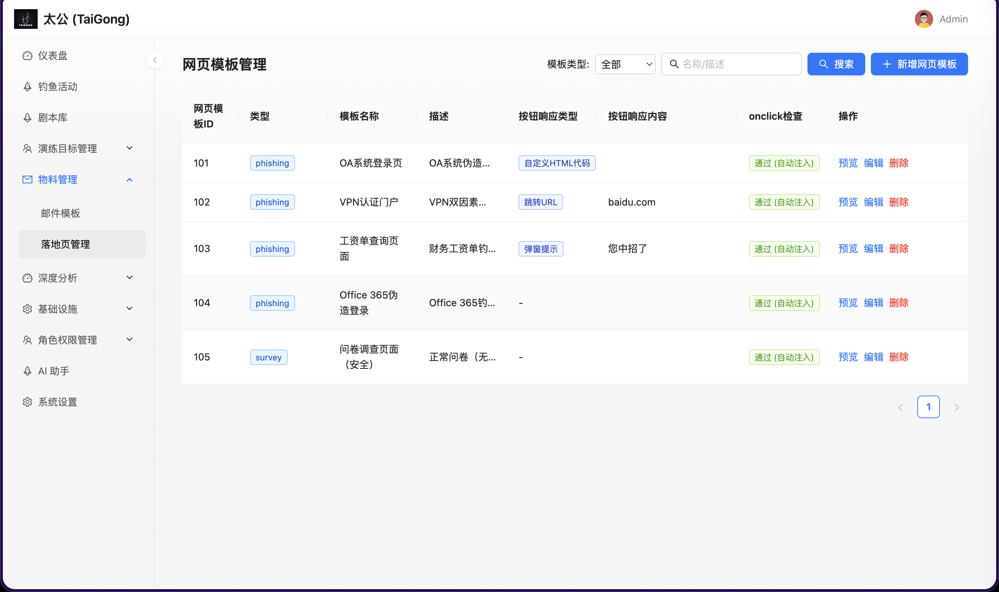 |
| **模板市场** | **场景商店** |
| 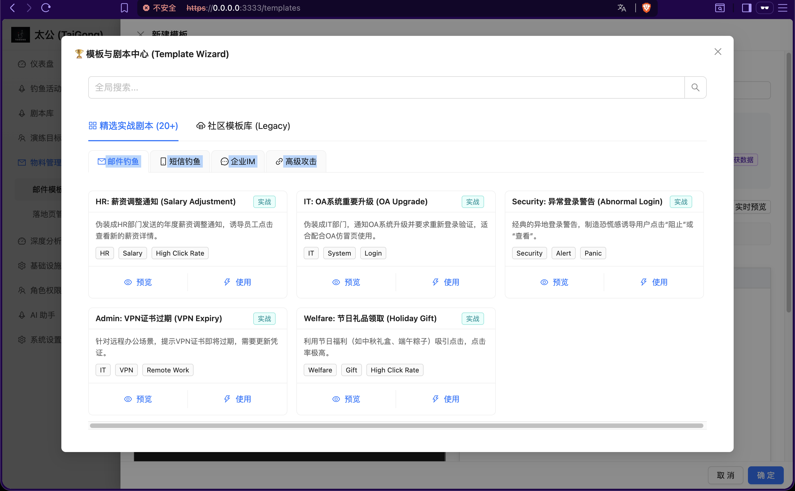 | 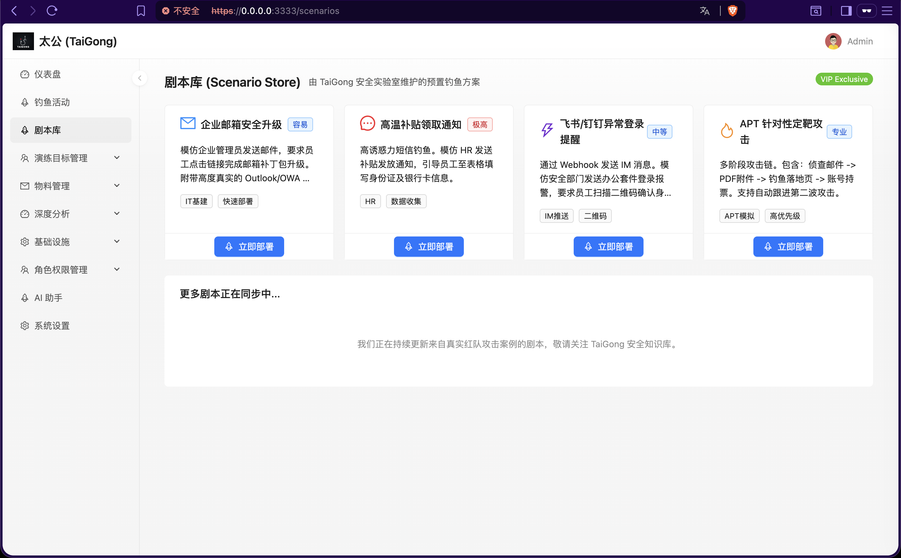 |

#### 时间轴与证据

| 行为溯源时间轴 | 环境特征捕获 |
|:---:|:---:|
| 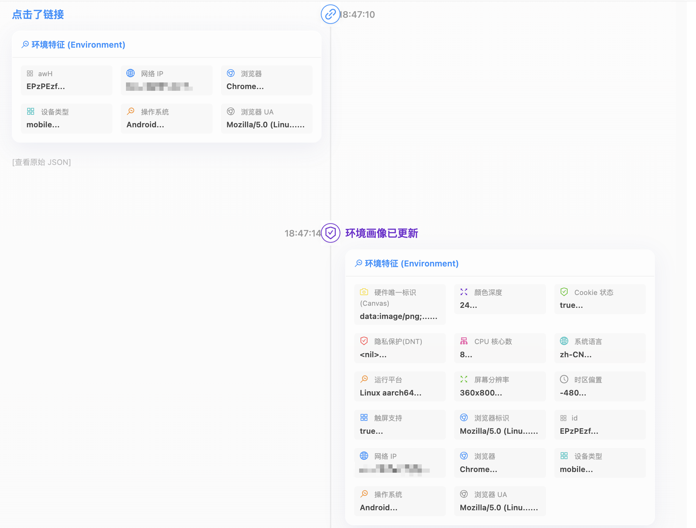 | 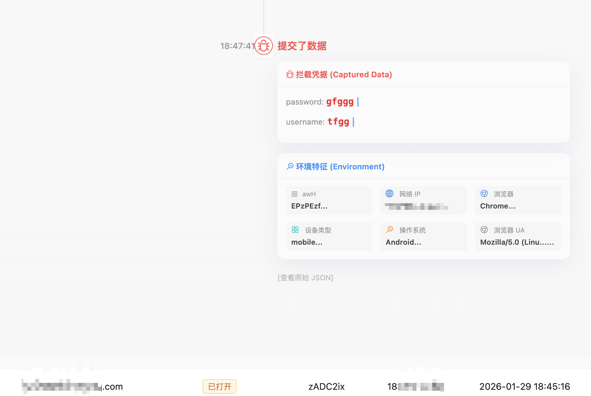 |

---

### 文档与手册

**完整知识库 (30,000+ 字红队作战手册)**

- [第 1 章: 基础设施与行动安全](doc/taigong-book/01_infrastructure.md)
- [第 2 章: 武器化与智能对抗](doc/taigong-book/02_weaponization.md)
- [第 3 章: 投递与协议](doc/taigong-book/03_delivery.md)
- [第 4 章: 自动化与编排](doc/taigong-book/04_automation.md)
- [第 5 章: 态势感知与反侦察](doc/taigong-book/05_analytics.md)
- [第 6 章: 高级识别技术](doc/taigong-book/06_advanced_identification.md)
- [第 7 章: 信任劫持](doc/taigong-book/07_trust_hijacking.md)
- [第 8 章: 载荷工程](doc/taigong-book/08_artifact_engineering.md)

---

### 开发路线 (Roadmap)

#### 已完成

- ✅ **Phase 1** — 编译级去指纹，透明重定向，盲搜 RID
- ✅ **Phase 2** — React 18 前端全重构，64 个专业模板
- ✅ **Phase 3** — AI 话术生成，SOAR 自动化，多租户架构
- ✅ **Phase 4** — RBAC 权限体系，审计日志，国际化
- ✅ **Phase 5** — **6 节点 Evasion Pipeline，语义稀释引擎，Quality Gate，Circuit Breaker**
- ✅ **Phase 6** — **Phishlet 反代，会话捕获，多阶段攻击链，安全意识培训模块**

#### 近期计划 (Q2-Q3 2026)

**Phase 7: 凭证对抗升级**
- 2FA/MFA 中继 — Evilginx 风格实时 MITM，捕获一次性验证码
- OAuth 劫持链 — 支持对接 SSO 单点登录场景（SAML/OIDC）
- Session Token 自动提取与回放

**Phase 8: 情报与健康度**
- 威胁情报集成 — 自动检查域名 VirusTotal / Google Safe Browsing 状态
- 健康度监控 — 域名被标记时自动暂停 Campaign 或切换备用域名
- SMTP 信誉预检 — 发送前评估域名 IP 的黑名单状态

**Phase 9: 生态开放**
- 插件 SDK — 支持第三方扩展模块
- CobaltStrike 原生联动 — 提交凭据后自动 Beacon 上线
- HTML5 Smuggling 生成器 — 绕过邮件网关文件类型检测

---

### 与原版 Gophish 的深度对比

| 特征 | 官方 Gophish (v0.12.1) | TaiGong (2025) |
|---|---|---|
| **界面** | 英文 Bootstrap UI | React 18 + Ant Design 5，三语支持 |
| **邮件指纹** | 含 X-Gophish 头 | 零特征，伪装 Outlook/Zoho |
| **投递渠道** | 仅 Email | Email + SMS + IM + QR + 回复链 |
| **反爬对抗** | 基本无 | JA4 + 地理围栏 + 沙箱检测 + 云端黑名单 |
| **免杀能力** | 无 | 6 节点 Evasion Pipeline + 语义稀释 |
| **Phishlet** | 无 | 完整的 Phishlet 反代 + 凭据捕获 |
| **AI 能力** | 无 | 接入 OpenAI/GLM，批量生成鱼叉内容 |
| **自动化** | 无 | SOAR (Cron/Event/Webhook) 编排引擎 |
| **意识培训** | 无 | 完整课程/测验/批次/成绩闭环 |
| **权限管理** | 简单 Admin/User | RBAC 66权限/5角色/多租户 |
| **报告** | 无 | PDF 一键导出 + 风险评分 |
| **数据可视化** | 基础表格 | ECharts 漏斗/热力/雷达图 |

---

### 免责声明

**本工具仅供合法授权的红队演练及安全研究使用。**

使用本软件即表示您同意：
- 仅在获得明确书面授权的环境中使用
- 遵守所在国家/地区的网络安全法律法规
- 不将本工具用于任何恶意或非法目的
- 妥善保管捕获的敏感数据，不得泄露或滥用
- 开发者不对任何非法滥用行为承担法律责任

**Hack the Planet, Legally.**

---

### 贡献指南

本项目目前处于内部开发阶段，暂不接受外部 Pull Request。待正式发布后将公开贡献指南。

---


## English Documentation

### Project Status

**This project is currently in Pre-Release stage, actively iterated internally.**

- **Internal Testing** — Current version is for internal development and red team validation
- **Not Publicly Available** — No immediate plans for public release
- **Active Development** — Core features and architecture under rapid iteration

---

### Background

Over the past decade, **Gophish** defined the standard for open-source phishing platforms. Effective but aging. Facing 2025's defense landscape — highly sensitive EDRs, ubiquitous Zero Trust architectures, and AI email gateways with semantic understanding — the traditional approach falls short.

**TaiGong** is not a simple fork. It is a near-complete rewrite across three axes: **Weaponization**, **Intelligence**, and **Enterprise-Grade Operations**.

---

### Core Features

#### ⚔️ Evasion Pipeline

The most significant technical contribution of this release — a composable 6-node content transformation pipeline:

**6 Transform Nodes**

| Node | Function |
|---|---|
| `polymorphic_attrs` | Randomize HTML attribute structures to break static signature matching |
| `dom_variation` | DOM structure mutation with random hidden elements and comment blocks |
| `fingerprint_break` | Inject HTTP/TLS layer fingerprint interference code |
| `semantic_dilution` | Semantic dilution — inject industry-benign corpus to confuse AI email gateways |
| `entity_noise` | HTML entity noise injection — invisible Unicode interference sequences |
| `mime_dilution` | MIME-layer dilution to confuse sandbox structural analysis |

**3 Strategy Presets**
- `light` — Minimal transformation for low-risk internal exercises
- `standard` — Balanced evasion and readability (**default**)
- `aggressive` — All nodes enabled, targeting top-tier EDRs and AI email gateways

**Governance Layer**
- **Quality Gate** — Validates transformed HTML for size and structure anomalies
- **Circuit Breaker** — State-machine based automatic fallback on high failure rate
- **Custom Strategy DSL** — JSON-configurable node combinations and budgets
- **Pipeline Manifest** — Complete transformation audit trail (InputHash / OutputHash / MutationCount)

#### 🛡️ Access Control & Anti-Detection

- **Magic Page / Sandbox Detection** — JS probes detect headless browsers and security sandboxes
- **Geo-Fencing** — IP-based country/region access restriction with silent redirect
- **Cloud Datacenter Blacklist** — Auto-block AWS, Alibaba Cloud, Tencent Cloud, Azure IP ranges
- **JA4/TLS Fingerprinting** — Capture and filter on visitor TLS fingerprints
- **IP Blacklist** — CIDR-level manual access filtering
- **Bot Detection Engine** — Dedicated UA and behavioral pattern analysis
- **Hot Configuration Reload** — No restart required for policy changes

#### 🔁 Phishlet Reverse Proxy

- **Phishlet Management** — Define proxy host mappings, content sub-filters, auth token capture rules, and inject JS
- **Session Capture** — Record cookies/tokens extracted via MITM proxy
- **YAML Rule Import** — Compatible with Evilginx2 community phishlet format

#### 🤖 SOAR Automation Engine

| Trigger | Description |
|---|---|
| `cron` | Cron expression scheduling (e.g., every Monday 9AM) |
| `new_employee` | Trigger N days after hire date |
| `event` | Real-time event-driven (link click → auto-send follow-up alert) |

Actions: **campaign creation** or **webhook** (POST to external SIEM/C2).

#### 📚 Awareness Training

Complete attack-train-retest lifecycle:
- Multi-module courses (Email + Landing Page + Quiz)
- Quiz types: single/multiple choice, true/false, short answer
- Batch management with immediate or scheduled dispatch
- Score tracking, pass/fail by target, batch-level compliance reports

#### 🏢 Enterprise RBAC + Audit

- 66 fine-grained permissions across 5 system roles
- Complete tenant data isolation
- Full audit log for all sensitive operations

#### 📡 Multi-Channel Delivery

Email (SMTP + CID images) | SMS (Alibaba/Tencent/Twilio) | IM (DingTalk/Feishu/WeChat Work) | QR Code | Reply-Chain Attack

#### 📊 Analytics & Reporting

Real-time Dashboard | Funnel Charts | Geo Heatmap | Risk Radar | Risk Scoring | PDF Export

---

### Architecture

```
┌───────────────────────────────────────────────────────────┐
│          CDN / Nginx Reverse Proxy                        │
│      (TLS Termination, Domain Fronting, Header Forwarding)│
└──────────────────────┬────────────────────────────────────┘
                       │
┌──────────────────────▼────────────────────────────────────┐
│               TaiGong Core Process                        │
│                                                           │
│  Admin Server (3333)        Phish Server (80/443)         │
│  · React 18 SPA             · Landing Pages               │
│  · REST API                 · Evasion Pipeline            │
│  · WebSocket                · Phishlet Reverse Proxy      │
│  · RBAC Guards              · Fingerprint/Event Capture   │
│                                                           │
│  Evasion Pipeline                                         │
│  ① polymorphic_attrs  ② dom_variation                    │
│  ③ fingerprint_break  ④ semantic_dilution                │
│  ⑤ entity_noise       ⑥ mime_dilution                    │
│  Quality Gate ← Circuit Breaker                          │
│                                                           │
│  Worker / Scheduler                                       │
│  · Email/SMS/IM Mailer                                    │
│  · SOAR Automation (Cron/Event)                           │
│  · Awareness Training Dispatcher                          │
│  · AI Content Generation                                  │
└──────────────────────┬────────────────────────────────────┘
                       │
┌──────────────────────▼────────────────────────────────────┐
│  Data Layer: SQLite (default) / MySQL                     │
│  Cache: Redis (optional, WebSocket queue)                 │
└───────────────────────────────────────────────────────────┘
```

**Technology Stack**

| Component | Technology | Notes |
|---|---|---|
| Backend | Go 1.20+ | High concurrency, single binary |
| Frontend | React 18 + Ant Design 5 + Vite | go:embed for zero-dependency deploy |
| Database | SQLite / MySQL | GORM ORM |
| WebSocket | Gorilla WS | Real-time dashboard push |
| Security | JA4 + TLS Fingerprint | `psanford/tlsfingerprint` |
| Scheduler | Cron + Worker Pool | SOAR automation |
| TLS | AutoCert (Let's Encrypt) + Self-signed | Built-in ACME client |

---

### Quick Start

#### Requirements

- Go 1.20+
- Node.js 18+ (build-time only)
- SQLite 3 / MySQL 5.7+
- Redis (optional)

#### One-Click Build

```bash
git clone https://github.com/25smoking/TaiGong-Project.git && cd TaiGong-Project
./build-unified.sh        # Builds frontend → embeds → compiles Go binary
cp config.json.example config.json
./taigong-backend
# Access: https://localhost:3333
```

#### Docker

```bash
docker build -t taigong:latest .
docker run -d --name taigong \
  -p 3333:3333 -p 80:80 \
  -v $(pwd)/taigong.db:/app/taigong.db \
  -v $(pwd)/config.json:/app/config.json \
  taigong:latest
```

---

### Roadmap

#### Completed
- ✅ Phase 1-4: De-fingerprinting, React rebuild, AI generation, SOAR, RBAC, i18n
- ✅ Phase 5: **6-node Evasion Pipeline, Semantic Dilution, Quality Gate, Circuit Breaker**
- ✅ Phase 6: **Phishlet reverse proxy, session capture, multi-stage campaigns, awareness training**

#### Upcoming (Q2-Q3 2026)
- **Phase 7**: 2FA/MFA relay, OAuth hijack, session token replay
- **Phase 8**: Threat intel integration, SMTP health monitoring, domain auto-pause
- **Phase 9**: Plugin SDK, CobaltStrike integration, HTML5 Smuggling generator

---

### Disclaimer

**This tool is intended ONLY for authorized red team engagements and security research.**

By using this software, you agree to use it only in explicitly authorized environments, comply with applicable cybersecurity laws, and not use it for any malicious or illegal purposes. Developers bear no legal responsibility for unauthorized misuse.

**Hack the Planet, Legally.**

---

### License

Licensed under [MIT License](LICENSE).

---

### Contact

- **GitHub Issues**: [Submit Issue](https://github.com/25smoking/TaiGong-Project/issues)
- **WeChat**:

  

---

<div align="center">

**© 2026 TaiGong Security Lab | 太公安全实验室**

**Made with care for the Red Team Community**

_Based on [Gophish](https://github.com/gophish/gophish) v0.12.1 — MIT License_

</div>
